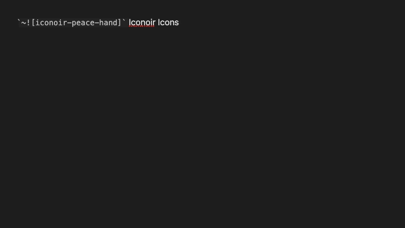
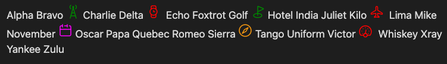
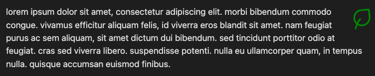
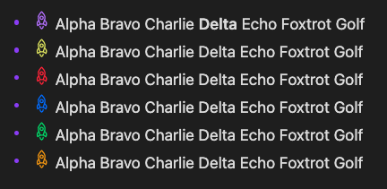
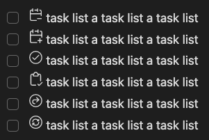
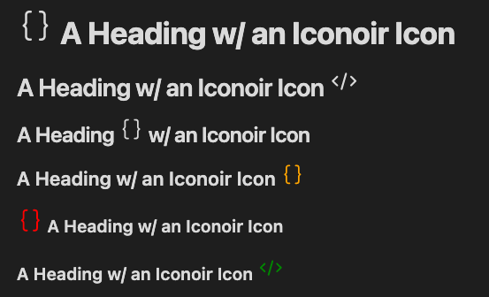
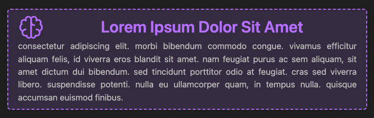
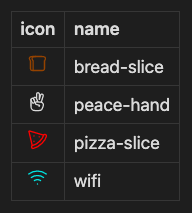
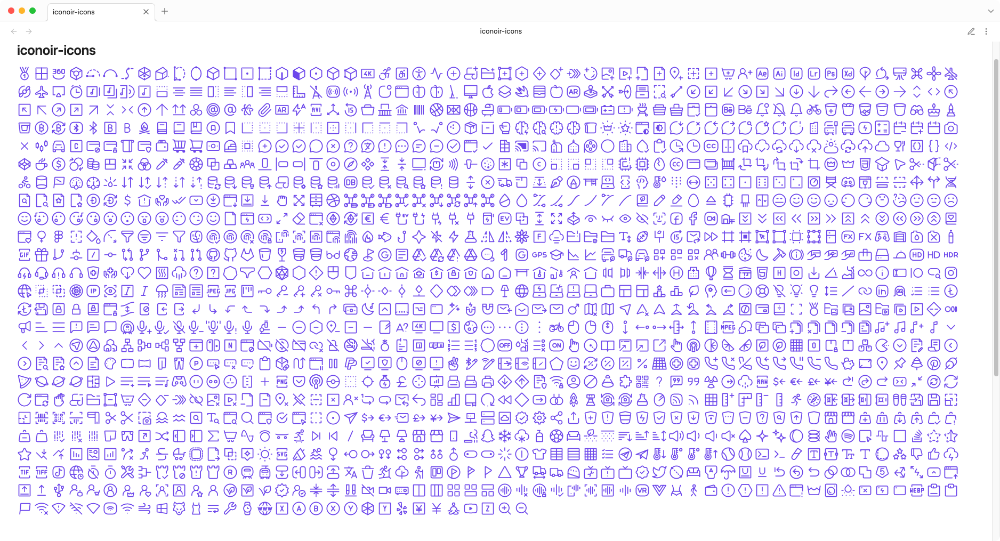
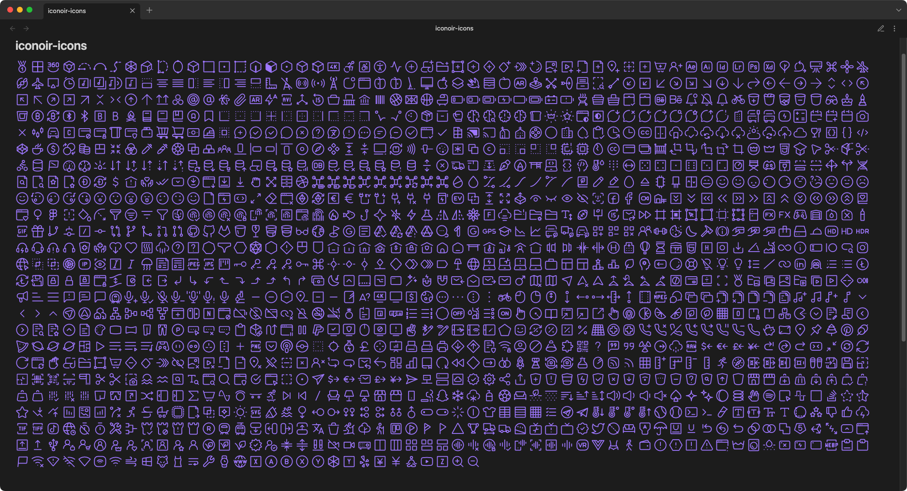

# iconoir-icons

A plugin for creating & displaying customized SVG [Iconoir Icons](https://iconoir.com/) in [Obsidian](https://obsidian.md).

> ⚠️ NOTICE
> 
> Iconoir
> Copyright (c) 2023 Luca Burgio - https://iconoir.com
> License - https://github.com/lucaburgio/iconoir/blob/main/LICENSE (Code: MIT License)

## features

### icon search suggestions


### custom `CSS` styles



## syntax

To trigger the icon name suggestion interface, type the ampersand key twice(`&&`) and start typing a query.

The syntax for the icon component is:

```markdown
`~![ICON|COLOR|W|H|STYLE]`

The delimiter is the pipe symbol `|`.

ICON = the name of the icon e.g. iconoir-peace-hand
COLOR= the CSS color of the icon e.g. purple
W= the CSS width of the icon e.g. 1em
H= the CSS height of the icon e.g. 1em
STYLE = the CSS rule(s) for the icon component e.g. float:right;

ONLY the ICON name is required. ALL others optional.

`~![iconoir-peace-hand|purple|1em|1em|float:right;]`
```

## examples

See the `examples` directory for additional sample code.

### basic block

```markdown
Alpha Bravo `~![iconoir-antenna|green|22px|22px]` Charlie Delta `~![iconoir-wristwatch|red|22px|22px]` Echo Foxtrot Golf `~![iconoir-golf|green|22px|22px]` Hotel India Juliet Kilo `~![iconoir-airplane|red|22px|22px]` Lima Mike November `~![iconoir-calendar|magenta|22px|22px]` Oscar Papa Quebec Romeo Sierra `~![iconoir-compass|var(--color-orange)|22px|22px]` Tango Uniform Victor `~![iconoir-dashboard-dots|red|22px|22px]` Whiskey Xray Yankee Zulu
```

#### results



```markdown
`~![iconoir-leaf|green|48px|48px|float:right;]` lorem ipsum dolor sit amet, consectetur adipiscing elit. morbi bibendum commodo congue. vivamus efficitur aliquam felis, id viverra eros blandit sit amet. nam feugiat purus ac sem aliquam, sit amet dictum dui bibendum. sed tincidunt porttitor odio at feugiat. cras sed viverra libero. suspendisse potenti. nulla eu ullamcorper quam, in tempus nulla. quisque accumsan euismod finibus.
```

#### results



### lists

```markdown
- `~![iconoir-rocket|var(--color-purple)]` Alpha Bravo Charlie Delta Echo Foxtrot Golf
- `~![iconoir-rocket|var(--color-yellow)]` Alpha Bravo Charlie Delta Echo Foxtrot Golf
- `~![iconoir-rocket|var(--color-red)]` Alpha Bravo Charlie Delta Echo Foxtrot Golf
- `~![iconoir-rocket|var(--color-blue)]` Alpha Bravo Charlie Delta Echo Foxtrot Golf
- `~![iconoir-rocket|var(--color-green)]` Alpha Bravo Charlie Delta Echo Foxtrot Golf
- `~![iconoir-rocket|var(--color-orange)]` Alpha Bravo Charlie Delta Echo Foxtrot Golf
```

#### results



```markdown
- [ ] `~![iconoir-calendar-minus|currentColor]` task list a task list a task list
- [ ] `~![iconoir-calendar-plus|currentColor]` task list a task list a task list
- [ ] `~![iconoir-check-circle|currentColor]` task list a task list a task list
- [ ] `~![iconoir-clipboard-check|currentColor]` task list a task list a task list
- [ ] `~![iconoir-redo-circle|currentColor]` task list a task list a task list
- [ ] `~![iconoir-refresh-circular|currentColor]` task list a task list a task list
```

#### results




### headings

```markdown
# `~![iconoir-code-brackets|currentColor]` A Heading w/ an Iconoir Icon
## A Heading w/ an Iconoir Icon `~![iconoir-code|currentColor]`
### A Heading `~![iconoir-code-brackets|currentColor]` w/ an Iconoir Icon
#### A Heading w/ an Iconoir Icon `~![iconoir-code-brackets|orange]`
##### `~![iconoir-code-brackets|red|1.5em|1.5em]` A Heading w/ an Iconoir Icon
###### A Heading w/ an Iconoir Icon `~![iconoir-code|green|1.5em|1.5em]`
```

#### results



### callout styled block

```markdown
`~![iconoir-brain|currentColor|48px|48px]` **Lorem Ipsum Dolor Sit Amet** consectetur adipiscing elit. morbi bibendum commodo congue. vivamus efficitur aliquam felis, id viverra eros blandit sit amet. nam feugiat purus ac sem aliquam, sit amet dictum dui bibendum. sed tincidunt porttitor odio at feugiat. cras sed viverra libero. suspendisse potenti. nulla eu ullamcorper quam, in tempus nulla. quisque accumsan euismod finibus.
```

```css
p:has(iconoir-icon[name=iconoir-brain]) {
  display: flex;
  flex-wrap: wrap;
  align-items: flex-start;
  color: var(--text-muted);
  border-radius: 6px;
  border: 2px dashed var(--color-purple);
  padding: 9px 18px;
  background-color: rgba(var(--color-purple-rgb), 0.15);
  text-align: justify;
}
iconoir-icon[name=iconoir-brain] {
  color:var(--color-purple);
  display:flex;
  margin-right: 7px;
}
strong {
  color:var(--color-purple);
  font-size: 1.88em;  
  text-align: center;
  flex-grow: 1;
}
```

#### results



### tables

> **NOTE:** When using icons in a table, the PIPE `|` symbol must be escaped w/ a BACKSLASH `\`
> e.g. `\|`

```markdown
|                  icon                  | name        |
|:--------------------------------------:| ----------- |
| `~![iconoir-bread-slice\|saddlebrown]` | bread-slice |
| `~![iconoir-peace-hand\|currentColor]` | peace-hand  |
|     `~![iconoir-pizza-slice\|red]`     | pizza-slice |
| `~![iconoir-wifi\|var(--color-cyan)]`  | wifi        |
```

### results




### additional `CSS` class support

- When using icons inside a `<th>` or  `<td>`, the CSS class `special-iconoir-th-callout` or `special-iconoir-td-callout` is added to the element.
- When using icons inside a `<li>`, the CSS class `special-iconoir-list-callout` is added to the element.
- In addition, a `data-icon` attribute, w/ the icon name, is added to the same element for added specificity.

```html
<td class="special-iconoir-th-callout" data-icon="iconoir-heart">
 <icon-component>
</td>

<li class="special-iconoir-list-callout" data-icon="iconoir-peace-hand">
 <icon-component>
</li>
```

## plugin installation

From Obsidian's settings or preferences:

1. ~~Community Plugins > Browse~~
2. ~~Search for "iconoir"~~

or:

1. download the latest [release archive](https://github.com/gapmiss/iconoir-icons/releases/download/0.0.1/iconoir-icons-v0.0.1.zip)
2. uncompress the downloaded archive
3. move the `iconoir-icons` folder to `/path/to/vault/.obsidian/plugins/` 
4.  Settings > Community plugins > reload **Installed plugins**
5.  enable plugin

or:

1.  download `main.js`, `manifest.json` & `styles.css`
2.  create a new folder `/path/to/vault/.obsidian/plugins/iconoir-icons`
3.  move all 3 files to `/path/to/vault/.obsidian/plugins/iconoir-icons`
4.  Settings > Community plugins > reload **Installed plugins**
5.  enable plugin

## screenshots





## development

### clone this repo

```bash
cd /path/to/vault/.obsidian/plugins
git clone https://github.com/gapmiss/iconoir-icons.git
cd iconoir-icons
```

### install packages and run

```bash
npm i
npm run dev
```

### enable plugin

1.  open `Settings` → `Community plugins`
2.  enable the `Iconoir Icons` plugin.

## caveats

- 2023-02-09 None known at this time.
- 2023-05-27 None known at this time.
